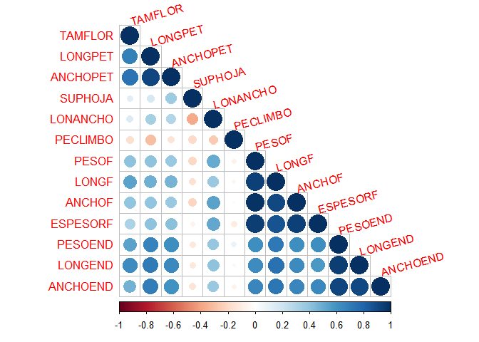
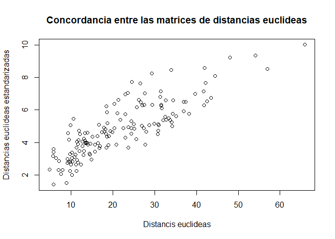
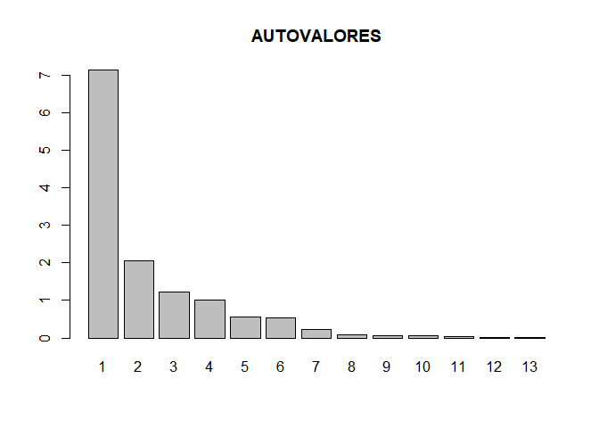
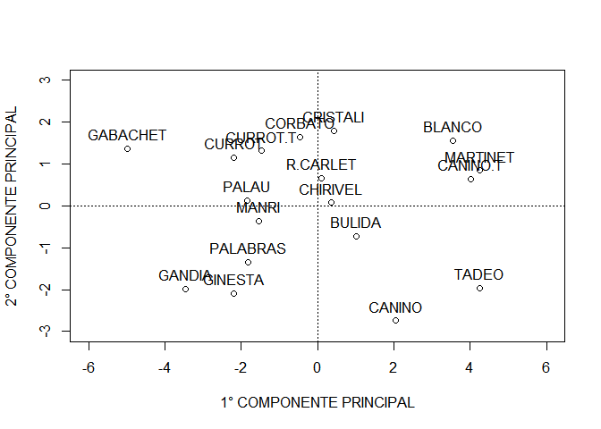

## Librerias


```r
library(tidyverse)
library(kableExtra)
```

## Datos


```r
datos <- read_csv2("../data/raw/DAMASCO.csv")
```

Inspeccionamos con `str(datos)`


```r
str(datos)
```

```
## spec_tbl_df[,14] [18 x 14] (S3: spec_tbl_df/tbl_df/tbl/data.frame)
##  $ VAR     : chr [1:18] "BLANCO" "BULIDA" "CURROT.T" "CANINO" ...
##  $ TAMFLOR : num [1:18] 33.3 26.8 28.8 27.5 33.9 ...
##  $ LONGPET : num [1:18] 13.9 13.4 12.7 12.3 14.4 ...
##  $ ANCHOPET: num [1:18] 18.3 15.9 15.4 14.3 16.4 ...
##  $ SUPHOJA : num [1:18] 44.1 36.7 51.7 36 39 ...
##  $ LONANCHO: num [1:18] 1.053 1.112 0.912 1.005 1.058 ...
##  $ PECLIMBO: num [1:18] 0.415 0.395 0.389 0.452 0.311 0.411 0.385 0.344 0.412 0.41 ...
##  $ PESOF   : num [1:18] 49.3 49 43 66.8 63.1 ...
##  $ LONGF   : num [1:18] 46.3 44.6 40.1 51.3 50.7 ...
##  $ ANCHOF  : num [1:18] 44.9 45.1 43.5 50.8 49.2 ...
##  $ ESPESORF: num [1:18] 45.4 43.4 43 49.1 46.8 ...
##  $ PESOEND : num [1:18] 4.31 2.57 1.62 3.42 3.34 3.46 1.88 2.58 1.52 1.2 ...
##  $ LONGEND : num [1:18] 31.1 25.3 20.1 23.8 29.1 ...
##  $ ANCHOEND: num [1:18] 24.2 20.3 17.6 21.2 22.9 ...
##  - attr(*, "spec")=
##   .. cols(
##   ..   VAR = col_character(),
##   ..   TAMFLOR = col_double(),
##   ..   LONGPET = col_double(),
##   ..   ANCHOPET = col_double(),
##   ..   SUPHOJA = col_double(),
##   ..   LONANCHO = col_double(),
##   ..   PECLIMBO = col_double(),
##   ..   PESOF = col_double(),
##   ..   LONGF = col_double(),
##   ..   ANCHOF = col_double(),
##   ..   ESPESORF = col_double(),
##   ..   PESOEND = col_double(),
##   ..   LONGEND = col_double(),
##   ..   ANCHOEND = col_double()
##   .. )
```


**A.** Cuáles son los valores de n y p ? Cuanto vale y que indica el valor $x_{32}$ ? Y el vector $x_6$ ?


El valor de $n$ es 18 y el valor de $p$ es 14. El
valor de $x_{32}$ es 28.84 e indica el tamaño de la flor de la 
observacion 3. El vector $x_6$ indica la relacion entre el ancho y largo de la 
hoja.

**B.** Cómo clasificaría las variables sobre las que se está trabajando ?


Las variables con las que se esta trabajando son de tipo continuo en todos los 
casos. Mas aun, todas estan medidas en escala de intervalo.


**C.** Encuentre el vector de medias y matriz de varianzas-covariancias asociados a la tabla de datos ?

Las medias son:


```r
datos %>% 
    select(-VAR) %>% 
    summarise_all(mean, na.rm=T) %>% 
    round(1) %>% 
    kableExtra::kable() %>% 
    kableExtra::kable_styling(font_size = 10) %>% 
    kableExtra::kable_classic_2()
```

<table class="table lightable-classic-2" style='font-size: 10px; margin-left: auto; margin-right: auto; font-family: "Arial Narrow", "Source Sans Pro", sans-serif; margin-left: auto; margin-right: auto;'>
 <thead>
  <tr>
   <th style="text-align:right;"> TAMFLOR </th>
   <th style="text-align:right;"> LONGPET </th>
   <th style="text-align:right;"> ANCHOPET </th>
   <th style="text-align:right;"> SUPHOJA </th>
   <th style="text-align:right;"> LONANCHO </th>
   <th style="text-align:right;"> PECLIMBO </th>
   <th style="text-align:right;"> PESOF </th>
   <th style="text-align:right;"> LONGF </th>
   <th style="text-align:right;"> ANCHOF </th>
   <th style="text-align:right;"> ESPESORF </th>
   <th style="text-align:right;"> PESOEND </th>
   <th style="text-align:right;"> LONGEND </th>
   <th style="text-align:right;"> ANCHOEND </th>
  </tr>
 </thead>
<tbody>
  <tr>
   <td style="text-align:right;"> 28.9 </td>
   <td style="text-align:right;"> 12.9 </td>
   <td style="text-align:right;"> 15.5 </td>
   <td style="text-align:right;"> 41 </td>
   <td style="text-align:right;"> 1 </td>
   <td style="text-align:right;"> 0.4 </td>
   <td style="text-align:right;"> 46.7 </td>
   <td style="text-align:right;"> 42 </td>
   <td style="text-align:right;"> 43.7 </td>
   <td style="text-align:right;"> 43.9 </td>
   <td style="text-align:right;"> 2.4 </td>
   <td style="text-align:right;"> 22 </td>
   <td style="text-align:right;"> 19.7 </td>
  </tr>
</tbody>
</table>

La matriz de covarianza es:


```r
datos %>% 
    select(-VAR) %>%  
    cov() %>%  
    round(1) %>% 
    kableExtra::kable() %>% 
    kableExtra::kable_styling(font_size = 10)%>% 
    kableExtra::kable_classic_2() 
```

<table class="table lightable-classic-2" style='font-size: 10px; margin-left: auto; margin-right: auto; font-family: "Arial Narrow", "Source Sans Pro", sans-serif; margin-left: auto; margin-right: auto;'>
 <thead>
  <tr>
   <th style="text-align:left;">   </th>
   <th style="text-align:right;"> TAMFLOR </th>
   <th style="text-align:right;"> LONGPET </th>
   <th style="text-align:right;"> ANCHOPET </th>
   <th style="text-align:right;"> SUPHOJA </th>
   <th style="text-align:right;"> LONANCHO </th>
   <th style="text-align:right;"> PECLIMBO </th>
   <th style="text-align:right;"> PESOF </th>
   <th style="text-align:right;"> LONGF </th>
   <th style="text-align:right;"> ANCHOF </th>
   <th style="text-align:right;"> ESPESORF </th>
   <th style="text-align:right;"> PESOEND </th>
   <th style="text-align:right;"> LONGEND </th>
   <th style="text-align:right;"> ANCHOEND </th>
  </tr>
 </thead>
<tbody>
  <tr>
   <td style="text-align:left;"> TAMFLOR </td>
   <td style="text-align:right;"> 9.9 </td>
   <td style="text-align:right;"> 2.2 </td>
   <td style="text-align:right;"> 4.1 </td>
   <td style="text-align:right;"> 2.2 </td>
   <td style="text-align:right;"> 0.0 </td>
   <td style="text-align:right;"> 0 </td>
   <td style="text-align:right;"> 15.2 </td>
   <td style="text-align:right;"> 10.0 </td>
   <td style="text-align:right;"> 6.1 </td>
   <td style="text-align:right;"> 4.3 </td>
   <td style="text-align:right;"> 1.7 </td>
   <td style="text-align:right;"> 9.1 </td>
   <td style="text-align:right;"> 3.7 </td>
  </tr>
  <tr>
   <td style="text-align:left;"> LONGPET </td>
   <td style="text-align:right;"> 2.2 </td>
   <td style="text-align:right;"> 1.0 </td>
   <td style="text-align:right;"> 1.6 </td>
   <td style="text-align:right;"> 1.0 </td>
   <td style="text-align:right;"> 0.0 </td>
   <td style="text-align:right;"> 0 </td>
   <td style="text-align:right;"> 4.9 </td>
   <td style="text-align:right;"> 2.9 </td>
   <td style="text-align:right;"> 1.9 </td>
   <td style="text-align:right;"> 1.8 </td>
   <td style="text-align:right;"> 0.7 </td>
   <td style="text-align:right;"> 3.3 </td>
   <td style="text-align:right;"> 1.8 </td>
  </tr>
  <tr>
   <td style="text-align:left;"> ANCHOPET </td>
   <td style="text-align:right;"> 4.1 </td>
   <td style="text-align:right;"> 1.6 </td>
   <td style="text-align:right;"> 3.1 </td>
   <td style="text-align:right;"> 3.5 </td>
   <td style="text-align:right;"> 0.0 </td>
   <td style="text-align:right;"> 0 </td>
   <td style="text-align:right;"> 7.9 </td>
   <td style="text-align:right;"> 4.9 </td>
   <td style="text-align:right;"> 3.2 </td>
   <td style="text-align:right;"> 3.2 </td>
   <td style="text-align:right;"> 1.1 </td>
   <td style="text-align:right;"> 5.3 </td>
   <td style="text-align:right;"> 2.7 </td>
  </tr>
  <tr>
   <td style="text-align:left;"> SUPHOJA </td>
   <td style="text-align:right;"> 2.2 </td>
   <td style="text-align:right;"> 1.0 </td>
   <td style="text-align:right;"> 3.5 </td>
   <td style="text-align:right;"> 32.6 </td>
   <td style="text-align:right;"> -0.1 </td>
   <td style="text-align:right;"> 0 </td>
   <td style="text-align:right;"> -14.3 </td>
   <td style="text-align:right;"> -5.2 </td>
   <td style="text-align:right;"> -5.8 </td>
   <td style="text-align:right;"> -1.7 </td>
   <td style="text-align:right;"> -0.7 </td>
   <td style="text-align:right;"> -3.2 </td>
   <td style="text-align:right;"> -2.1 </td>
  </tr>
  <tr>
   <td style="text-align:left;"> LONANCHO </td>
   <td style="text-align:right;"> 0.0 </td>
   <td style="text-align:right;"> 0.0 </td>
   <td style="text-align:right;"> 0.0 </td>
   <td style="text-align:right;"> -0.1 </td>
   <td style="text-align:right;"> 0.0 </td>
   <td style="text-align:right;"> 0 </td>
   <td style="text-align:right;"> 0.4 </td>
   <td style="text-align:right;"> 0.1 </td>
   <td style="text-align:right;"> 0.2 </td>
   <td style="text-align:right;"> 0.1 </td>
   <td style="text-align:right;"> 0.0 </td>
   <td style="text-align:right;"> 0.1 </td>
   <td style="text-align:right;"> 0.1 </td>
  </tr>
  <tr>
   <td style="text-align:left;"> PECLIMBO </td>
   <td style="text-align:right;"> 0.0 </td>
   <td style="text-align:right;"> 0.0 </td>
   <td style="text-align:right;"> 0.0 </td>
   <td style="text-align:right;"> 0.0 </td>
   <td style="text-align:right;"> 0.0 </td>
   <td style="text-align:right;"> 0 </td>
   <td style="text-align:right;"> 0.0 </td>
   <td style="text-align:right;"> 0.0 </td>
   <td style="text-align:right;"> 0.0 </td>
   <td style="text-align:right;"> 0.0 </td>
   <td style="text-align:right;"> 0.0 </td>
   <td style="text-align:right;"> 0.0 </td>
   <td style="text-align:right;"> 0.0 </td>
  </tr>
  <tr>
   <td style="text-align:left;"> PESOF </td>
   <td style="text-align:right;"> 15.2 </td>
   <td style="text-align:right;"> 4.9 </td>
   <td style="text-align:right;"> 7.9 </td>
   <td style="text-align:right;"> -14.3 </td>
   <td style="text-align:right;"> 0.4 </td>
   <td style="text-align:right;"> 0 </td>
   <td style="text-align:right;"> 144.4 </td>
   <td style="text-align:right;"> 67.5 </td>
   <td style="text-align:right;"> 57.5 </td>
   <td style="text-align:right;"> 49.7 </td>
   <td style="text-align:right;"> 7.5 </td>
   <td style="text-align:right;"> 35.0 </td>
   <td style="text-align:right;"> 19.6 </td>
  </tr>
  <tr>
   <td style="text-align:left;"> LONGF </td>
   <td style="text-align:right;"> 10.0 </td>
   <td style="text-align:right;"> 2.9 </td>
   <td style="text-align:right;"> 4.9 </td>
   <td style="text-align:right;"> -5.2 </td>
   <td style="text-align:right;"> 0.1 </td>
   <td style="text-align:right;"> 0 </td>
   <td style="text-align:right;"> 67.5 </td>
   <td style="text-align:right;"> 35.9 </td>
   <td style="text-align:right;"> 26.3 </td>
   <td style="text-align:right;"> 22.8 </td>
   <td style="text-align:right;"> 4.3 </td>
   <td style="text-align:right;"> 20.7 </td>
   <td style="text-align:right;"> 10.8 </td>
  </tr>
  <tr>
   <td style="text-align:left;"> ANCHOF </td>
   <td style="text-align:right;"> 6.1 </td>
   <td style="text-align:right;"> 1.9 </td>
   <td style="text-align:right;"> 3.2 </td>
   <td style="text-align:right;"> -5.8 </td>
   <td style="text-align:right;"> 0.2 </td>
   <td style="text-align:right;"> 0 </td>
   <td style="text-align:right;"> 57.5 </td>
   <td style="text-align:right;"> 26.3 </td>
   <td style="text-align:right;"> 23.6 </td>
   <td style="text-align:right;"> 19.9 </td>
   <td style="text-align:right;"> 3.1 </td>
   <td style="text-align:right;"> 14.5 </td>
   <td style="text-align:right;"> 7.9 </td>
  </tr>
  <tr>
   <td style="text-align:left;"> ESPESORF </td>
   <td style="text-align:right;"> 4.3 </td>
   <td style="text-align:right;"> 1.8 </td>
   <td style="text-align:right;"> 3.2 </td>
   <td style="text-align:right;"> -1.7 </td>
   <td style="text-align:right;"> 0.1 </td>
   <td style="text-align:right;"> 0 </td>
   <td style="text-align:right;"> 49.7 </td>
   <td style="text-align:right;"> 22.8 </td>
   <td style="text-align:right;"> 19.9 </td>
   <td style="text-align:right;"> 19.3 </td>
   <td style="text-align:right;"> 2.7 </td>
   <td style="text-align:right;"> 11.8 </td>
   <td style="text-align:right;"> 7.1 </td>
  </tr>
  <tr>
   <td style="text-align:left;"> PESOEND </td>
   <td style="text-align:right;"> 1.7 </td>
   <td style="text-align:right;"> 0.7 </td>
   <td style="text-align:right;"> 1.1 </td>
   <td style="text-align:right;"> -0.7 </td>
   <td style="text-align:right;"> 0.0 </td>
   <td style="text-align:right;"> 0 </td>
   <td style="text-align:right;"> 7.5 </td>
   <td style="text-align:right;"> 4.3 </td>
   <td style="text-align:right;"> 3.1 </td>
   <td style="text-align:right;"> 2.7 </td>
   <td style="text-align:right;"> 1.0 </td>
   <td style="text-align:right;"> 4.5 </td>
   <td style="text-align:right;"> 2.3 </td>
  </tr>
  <tr>
   <td style="text-align:left;"> LONGEND </td>
   <td style="text-align:right;"> 9.1 </td>
   <td style="text-align:right;"> 3.3 </td>
   <td style="text-align:right;"> 5.3 </td>
   <td style="text-align:right;"> -3.2 </td>
   <td style="text-align:right;"> 0.1 </td>
   <td style="text-align:right;"> 0 </td>
   <td style="text-align:right;"> 35.0 </td>
   <td style="text-align:right;"> 20.7 </td>
   <td style="text-align:right;"> 14.5 </td>
   <td style="text-align:right;"> 11.8 </td>
   <td style="text-align:right;"> 4.5 </td>
   <td style="text-align:right;"> 21.8 </td>
   <td style="text-align:right;"> 10.6 </td>
  </tr>
  <tr>
   <td style="text-align:left;"> ANCHOEND </td>
   <td style="text-align:right;"> 3.7 </td>
   <td style="text-align:right;"> 1.8 </td>
   <td style="text-align:right;"> 2.7 </td>
   <td style="text-align:right;"> -2.1 </td>
   <td style="text-align:right;"> 0.1 </td>
   <td style="text-align:right;"> 0 </td>
   <td style="text-align:right;"> 19.6 </td>
   <td style="text-align:right;"> 10.8 </td>
   <td style="text-align:right;"> 7.9 </td>
   <td style="text-align:right;"> 7.1 </td>
   <td style="text-align:right;"> 2.3 </td>
   <td style="text-align:right;"> 10.6 </td>
   <td style="text-align:right;"> 6.2 </td>
  </tr>
</tbody>
</table>

**D.** Podría decir cuál y cuáles variables son las más dispersas ?

Utilizando el coeficiente de variación, podemos decir que las variables más dispersas, en orden decreciente, son:


```r
datos %>% select(-VAR) %>%
    summarise_all(function(x) sd(x, na.rm=TRUE) /  mean(x, na.rm=TRUE)) %>% 
    pivot_longer(cols= everything(), names_to = "VAR", values_to="CV") %>% 
    arrange(desc(CV)) %>% 
    mutate(CV= round(CV, 1))%>%
    kableExtra::kable() %>% 
    kableExtra::kable_styling(font_size = 10)%>% 
    kableExtra::kable_classic_2()
```

<table class="table lightable-classic-2" style='font-size: 10px; margin-left: auto; margin-right: auto; font-family: "Arial Narrow", "Source Sans Pro", sans-serif; margin-left: auto; margin-right: auto;'>
 <thead>
  <tr>
   <th style="text-align:left;"> VAR </th>
   <th style="text-align:right;"> CV </th>
  </tr>
 </thead>
<tbody>
  <tr>
   <td style="text-align:left;"> PESOEND </td>
   <td style="text-align:right;"> 0.4 </td>
  </tr>
  <tr>
   <td style="text-align:left;"> PESOF </td>
   <td style="text-align:right;"> 0.3 </td>
  </tr>
  <tr>
   <td style="text-align:left;"> LONGEND </td>
   <td style="text-align:right;"> 0.2 </td>
  </tr>
  <tr>
   <td style="text-align:left;"> LONGF </td>
   <td style="text-align:right;"> 0.1 </td>
  </tr>
  <tr>
   <td style="text-align:left;"> SUPHOJA </td>
   <td style="text-align:right;"> 0.1 </td>
  </tr>
  <tr>
   <td style="text-align:left;"> ANCHOEND </td>
   <td style="text-align:right;"> 0.1 </td>
  </tr>
  <tr>
   <td style="text-align:left;"> ANCHOPET </td>
   <td style="text-align:right;"> 0.1 </td>
  </tr>
  <tr>
   <td style="text-align:left;"> ANCHOF </td>
   <td style="text-align:right;"> 0.1 </td>
  </tr>
  <tr>
   <td style="text-align:left;"> TAMFLOR </td>
   <td style="text-align:right;"> 0.1 </td>
  </tr>
  <tr>
   <td style="text-align:left;"> ESPESORF </td>
   <td style="text-align:right;"> 0.1 </td>
  </tr>
  <tr>
   <td style="text-align:left;"> PECLIMBO </td>
   <td style="text-align:right;"> 0.1 </td>
  </tr>
  <tr>
   <td style="text-align:left;"> LONGPET </td>
   <td style="text-align:right;"> 0.1 </td>
  </tr>
  <tr>
   <td style="text-align:left;"> LONANCHO </td>
   <td style="text-align:right;"> 0.1 </td>
  </tr>
</tbody>
</table>

**E.** Estandarice las variables por media y desvío. Ahora puede responder al inciso (d) ?


```r
# No utilizamos la primer columna
datos_std = scale(datos[-1])
```

Como son variables estandarizadas, el coeficiente de variacion no existe,
pero todas tienen desvio estandar 1 (ya que la media es 0)


```r
datos_std %>%
    as_tibble() %>% 
    summarise_all(function(x) sd(x, na.rm=TRUE) /  mean(x, na.rm=TRUE)) %>% 
    round(1)
```

```
## # A tibble: 1 x 13
##   TAMFLOR  LONGPET ANCHOPET SUPHOJA LONANCHO PECLIMBO   PESOF   LONGF   ANCHOF
##     <dbl>    <dbl>    <dbl>   <dbl>    <dbl>    <dbl>   <dbl>   <dbl>    <dbl>
## 1 2.22e15 -1.30e15 -5.65e15 3.13e15 -3.61e15  1.41e15 5.53e16 4.25e15 -2.52e15
## # ... with 4 more variables: ESPESORF <dbl>, PESOEND <dbl>, LONGEND <dbl>,
## #   ANCHOEND <dbl>
```

**F.** Halle la matriz de correlación. Que variables son las más relacionadas?

La matriz de correlación es:


```r
datos %>% 
    select(-VAR) %>%
    cor() %>% 
    round(1)  %>% 
    kableExtra::kable() %>% 
    kableExtra::kable_styling(font_size = 10)%>% 
    kableExtra::kable_classic_2()
```

<table class="table lightable-classic-2" style='font-size: 10px; margin-left: auto; margin-right: auto; font-family: "Arial Narrow", "Source Sans Pro", sans-serif; margin-left: auto; margin-right: auto;'>
 <thead>
  <tr>
   <th style="text-align:left;">   </th>
   <th style="text-align:right;"> TAMFLOR </th>
   <th style="text-align:right;"> LONGPET </th>
   <th style="text-align:right;"> ANCHOPET </th>
   <th style="text-align:right;"> SUPHOJA </th>
   <th style="text-align:right;"> LONANCHO </th>
   <th style="text-align:right;"> PECLIMBO </th>
   <th style="text-align:right;"> PESOF </th>
   <th style="text-align:right;"> LONGF </th>
   <th style="text-align:right;"> ANCHOF </th>
   <th style="text-align:right;"> ESPESORF </th>
   <th style="text-align:right;"> PESOEND </th>
   <th style="text-align:right;"> LONGEND </th>
   <th style="text-align:right;"> ANCHOEND </th>
  </tr>
 </thead>
<tbody>
  <tr>
   <td style="text-align:left;"> TAMFLOR </td>
   <td style="text-align:right;"> 1.0 </td>
   <td style="text-align:right;"> 0.7 </td>
   <td style="text-align:right;"> 0.7 </td>
   <td style="text-align:right;"> 0.1 </td>
   <td style="text-align:right;"> 0.2 </td>
   <td style="text-align:right;"> -0.2 </td>
   <td style="text-align:right;"> 0.4 </td>
   <td style="text-align:right;"> 0.5 </td>
   <td style="text-align:right;"> 0.4 </td>
   <td style="text-align:right;"> 0.3 </td>
   <td style="text-align:right;"> 0.5 </td>
   <td style="text-align:right;"> 0.6 </td>
   <td style="text-align:right;"> 0.5 </td>
  </tr>
  <tr>
   <td style="text-align:left;"> LONGPET </td>
   <td style="text-align:right;"> 0.7 </td>
   <td style="text-align:right;"> 1.0 </td>
   <td style="text-align:right;"> 0.9 </td>
   <td style="text-align:right;"> 0.2 </td>
   <td style="text-align:right;"> 0.3 </td>
   <td style="text-align:right;"> -0.3 </td>
   <td style="text-align:right;"> 0.4 </td>
   <td style="text-align:right;"> 0.5 </td>
   <td style="text-align:right;"> 0.4 </td>
   <td style="text-align:right;"> 0.4 </td>
   <td style="text-align:right;"> 0.7 </td>
   <td style="text-align:right;"> 0.7 </td>
   <td style="text-align:right;"> 0.7 </td>
  </tr>
  <tr>
   <td style="text-align:left;"> ANCHOPET </td>
   <td style="text-align:right;"> 0.7 </td>
   <td style="text-align:right;"> 0.9 </td>
   <td style="text-align:right;"> 1.0 </td>
   <td style="text-align:right;"> 0.4 </td>
   <td style="text-align:right;"> 0.3 </td>
   <td style="text-align:right;"> -0.1 </td>
   <td style="text-align:right;"> 0.4 </td>
   <td style="text-align:right;"> 0.5 </td>
   <td style="text-align:right;"> 0.4 </td>
   <td style="text-align:right;"> 0.4 </td>
   <td style="text-align:right;"> 0.6 </td>
   <td style="text-align:right;"> 0.6 </td>
   <td style="text-align:right;"> 0.6 </td>
  </tr>
  <tr>
   <td style="text-align:left;"> SUPHOJA </td>
   <td style="text-align:right;"> 0.1 </td>
   <td style="text-align:right;"> 0.2 </td>
   <td style="text-align:right;"> 0.4 </td>
   <td style="text-align:right;"> 1.0 </td>
   <td style="text-align:right;"> -0.4 </td>
   <td style="text-align:right;"> -0.2 </td>
   <td style="text-align:right;"> -0.2 </td>
   <td style="text-align:right;"> -0.2 </td>
   <td style="text-align:right;"> -0.2 </td>
   <td style="text-align:right;"> -0.1 </td>
   <td style="text-align:right;"> -0.1 </td>
   <td style="text-align:right;"> -0.1 </td>
   <td style="text-align:right;"> -0.1 </td>
  </tr>
  <tr>
   <td style="text-align:left;"> LONANCHO </td>
   <td style="text-align:right;"> 0.2 </td>
   <td style="text-align:right;"> 0.3 </td>
   <td style="text-align:right;"> 0.3 </td>
   <td style="text-align:right;"> -0.4 </td>
   <td style="text-align:right;"> 1.0 </td>
   <td style="text-align:right;"> -0.3 </td>
   <td style="text-align:right;"> 0.5 </td>
   <td style="text-align:right;"> 0.4 </td>
   <td style="text-align:right;"> 0.5 </td>
   <td style="text-align:right;"> 0.5 </td>
   <td style="text-align:right;"> 0.4 </td>
   <td style="text-align:right;"> 0.4 </td>
   <td style="text-align:right;"> 0.4 </td>
  </tr>
  <tr>
   <td style="text-align:left;"> PECLIMBO </td>
   <td style="text-align:right;"> -0.2 </td>
   <td style="text-align:right;"> -0.3 </td>
   <td style="text-align:right;"> -0.1 </td>
   <td style="text-align:right;"> -0.2 </td>
   <td style="text-align:right;"> -0.3 </td>
   <td style="text-align:right;"> 1.0 </td>
   <td style="text-align:right;"> -0.1 </td>
   <td style="text-align:right;"> -0.1 </td>
   <td style="text-align:right;"> 0.0 </td>
   <td style="text-align:right;"> -0.1 </td>
   <td style="text-align:right;"> 0.1 </td>
   <td style="text-align:right;"> 0.0 </td>
   <td style="text-align:right;"> -0.1 </td>
  </tr>
  <tr>
   <td style="text-align:left;"> PESOF </td>
   <td style="text-align:right;"> 0.4 </td>
   <td style="text-align:right;"> 0.4 </td>
   <td style="text-align:right;"> 0.4 </td>
   <td style="text-align:right;"> -0.2 </td>
   <td style="text-align:right;"> 0.5 </td>
   <td style="text-align:right;"> -0.1 </td>
   <td style="text-align:right;"> 1.0 </td>
   <td style="text-align:right;"> 0.9 </td>
   <td style="text-align:right;"> 1.0 </td>
   <td style="text-align:right;"> 0.9 </td>
   <td style="text-align:right;"> 0.6 </td>
   <td style="text-align:right;"> 0.6 </td>
   <td style="text-align:right;"> 0.7 </td>
  </tr>
  <tr>
   <td style="text-align:left;"> LONGF </td>
   <td style="text-align:right;"> 0.5 </td>
   <td style="text-align:right;"> 0.5 </td>
   <td style="text-align:right;"> 0.5 </td>
   <td style="text-align:right;"> -0.2 </td>
   <td style="text-align:right;"> 0.4 </td>
   <td style="text-align:right;"> -0.1 </td>
   <td style="text-align:right;"> 0.9 </td>
   <td style="text-align:right;"> 1.0 </td>
   <td style="text-align:right;"> 0.9 </td>
   <td style="text-align:right;"> 0.9 </td>
   <td style="text-align:right;"> 0.7 </td>
   <td style="text-align:right;"> 0.7 </td>
   <td style="text-align:right;"> 0.7 </td>
  </tr>
  <tr>
   <td style="text-align:left;"> ANCHOF </td>
   <td style="text-align:right;"> 0.4 </td>
   <td style="text-align:right;"> 0.4 </td>
   <td style="text-align:right;"> 0.4 </td>
   <td style="text-align:right;"> -0.2 </td>
   <td style="text-align:right;"> 0.5 </td>
   <td style="text-align:right;"> 0.0 </td>
   <td style="text-align:right;"> 1.0 </td>
   <td style="text-align:right;"> 0.9 </td>
   <td style="text-align:right;"> 1.0 </td>
   <td style="text-align:right;"> 0.9 </td>
   <td style="text-align:right;"> 0.6 </td>
   <td style="text-align:right;"> 0.6 </td>
   <td style="text-align:right;"> 0.7 </td>
  </tr>
  <tr>
   <td style="text-align:left;"> ESPESORF </td>
   <td style="text-align:right;"> 0.3 </td>
   <td style="text-align:right;"> 0.4 </td>
   <td style="text-align:right;"> 0.4 </td>
   <td style="text-align:right;"> -0.1 </td>
   <td style="text-align:right;"> 0.5 </td>
   <td style="text-align:right;"> -0.1 </td>
   <td style="text-align:right;"> 0.9 </td>
   <td style="text-align:right;"> 0.9 </td>
   <td style="text-align:right;"> 0.9 </td>
   <td style="text-align:right;"> 1.0 </td>
   <td style="text-align:right;"> 0.6 </td>
   <td style="text-align:right;"> 0.6 </td>
   <td style="text-align:right;"> 0.6 </td>
  </tr>
  <tr>
   <td style="text-align:left;"> PESOEND </td>
   <td style="text-align:right;"> 0.5 </td>
   <td style="text-align:right;"> 0.7 </td>
   <td style="text-align:right;"> 0.6 </td>
   <td style="text-align:right;"> -0.1 </td>
   <td style="text-align:right;"> 0.4 </td>
   <td style="text-align:right;"> 0.1 </td>
   <td style="text-align:right;"> 0.6 </td>
   <td style="text-align:right;"> 0.7 </td>
   <td style="text-align:right;"> 0.6 </td>
   <td style="text-align:right;"> 0.6 </td>
   <td style="text-align:right;"> 1.0 </td>
   <td style="text-align:right;"> 0.9 </td>
   <td style="text-align:right;"> 0.9 </td>
  </tr>
  <tr>
   <td style="text-align:left;"> LONGEND </td>
   <td style="text-align:right;"> 0.6 </td>
   <td style="text-align:right;"> 0.7 </td>
   <td style="text-align:right;"> 0.6 </td>
   <td style="text-align:right;"> -0.1 </td>
   <td style="text-align:right;"> 0.4 </td>
   <td style="text-align:right;"> 0.0 </td>
   <td style="text-align:right;"> 0.6 </td>
   <td style="text-align:right;"> 0.7 </td>
   <td style="text-align:right;"> 0.6 </td>
   <td style="text-align:right;"> 0.6 </td>
   <td style="text-align:right;"> 0.9 </td>
   <td style="text-align:right;"> 1.0 </td>
   <td style="text-align:right;"> 0.9 </td>
  </tr>
  <tr>
   <td style="text-align:left;"> ANCHOEND </td>
   <td style="text-align:right;"> 0.5 </td>
   <td style="text-align:right;"> 0.7 </td>
   <td style="text-align:right;"> 0.6 </td>
   <td style="text-align:right;"> -0.1 </td>
   <td style="text-align:right;"> 0.4 </td>
   <td style="text-align:right;"> -0.1 </td>
   <td style="text-align:right;"> 0.7 </td>
   <td style="text-align:right;"> 0.7 </td>
   <td style="text-align:right;"> 0.7 </td>
   <td style="text-align:right;"> 0.6 </td>
   <td style="text-align:right;"> 0.9 </td>
   <td style="text-align:right;"> 0.9 </td>
   <td style="text-align:right;"> 1.0 </td>
  </tr>
</tbody>
</table>

A continuacion una representacion grafica de la matriz de correlacion:      


```r
datos%>%
    select(-VAR)%>%
    cor()%>%
    corrplot::corrplot(method = c("circle"), type = "lower", tl.srt = 15)
```

<!-- -->

**G.** Pueden dividirse las variables en subgrupos, de modo que las variables dentro de un mismo subgrupo tengan elevadas correlaciones entre sí y que las que se encuentren en subgrupos diferentes tengan bajas correlaciones ? Si es así, cuáles variables quedan en cada uno de los subgrupos ?

*Los subgrupos de variables con altas correlaciones son los siguientes: 

  1. Peso, longitud, ancho y espesor del fruto (caracteristicas del fruto)
  2. Peso, longitud y ancho del endocarpio (caracteristicas del endocarpio)
  3. Tamaño de la flor, longitu y ancho del petalo (caracteristicas de la flor)

*El subgrupo de variables con bajas correlaciones son los siguientes: 

  1. Superficie de la hoja, relacion entre peciolo-limbo y relacion entre longitud y ancho de la hoja (caracteristicas de la hoja); tamaño de la flor, longitud y ancho del petalo (caracteristicas de la flor)

Cabe destacar que la superficie de la hoja y relacion peciolo-limbo estan muy poco correlacionadas con el resto de las variables.


**H.** Encuentre la matriz que mide el grado de similaridad entre las variedades en función de la distancia euclídea calculada sobre los datos originales.


```r
dist = datos %>% 
    select(-VAR) %>% 
    data.frame()

rownames(dist) <- datos$VAR

dist %>% 
    dist(method= "euclidean", diag = T, upper=T) %>% 
    as.matrix() %>% 
    round(1)  %>% 
    kableExtra::kable() %>% 
    kableExtra::kable_styling(font_size = 8)%>% 
    kableExtra::kable_classic_2()
```

<table class="table lightable-classic-2" style='font-size: 8px; margin-left: auto; margin-right: auto; font-family: "Arial Narrow", "Source Sans Pro", sans-serif; margin-left: auto; margin-right: auto;'>
 <thead>
  <tr>
   <th style="text-align:left;">   </th>
   <th style="text-align:right;"> BLANCO </th>
   <th style="text-align:right;"> BULIDA </th>
   <th style="text-align:right;"> CURROT.T </th>
   <th style="text-align:right;"> CANINO </th>
   <th style="text-align:right;"> CANINO.T </th>
   <th style="text-align:right;"> CHIRIVEL </th>
   <th style="text-align:right;"> CORBATO </th>
   <th style="text-align:right;"> CRISTALI </th>
   <th style="text-align:right;"> CURROT </th>
   <th style="text-align:right;"> GABACHET </th>
   <th style="text-align:right;"> GANDIA </th>
   <th style="text-align:right;"> GINESTA </th>
   <th style="text-align:right;"> MANRI </th>
   <th style="text-align:right;"> MARTINET </th>
   <th style="text-align:right;"> PALABRAS </th>
   <th style="text-align:right;"> PALAU </th>
   <th style="text-align:right;"> R.CARLET </th>
   <th style="text-align:right;"> TADEO </th>
  </tr>
 </thead>
<tbody>
  <tr>
   <td style="text-align:left;"> BLANCO </td>
   <td style="text-align:right;"> 0.0 </td>
   <td style="text-align:right;"> 12.7 </td>
   <td style="text-align:right;"> 18.5 </td>
   <td style="text-align:right;"> 23.6 </td>
   <td style="text-align:right;"> 16.4 </td>
   <td style="text-align:right;"> 14.0 </td>
   <td style="text-align:right;"> 18.4 </td>
   <td style="text-align:right;"> 17.9 </td>
   <td style="text-align:right;"> 20.4 </td>
   <td style="text-align:right;"> 41.9 </td>
   <td style="text-align:right;"> 24.5 </td>
   <td style="text-align:right;"> 23.6 </td>
   <td style="text-align:right;"> 23.0 </td>
   <td style="text-align:right;"> 10.2 </td>
   <td style="text-align:right;"> 21.3 </td>
   <td style="text-align:right;"> 21.1 </td>
   <td style="text-align:right;"> 13.7 </td>
   <td style="text-align:right;"> 30.9 </td>
  </tr>
  <tr>
   <td style="text-align:left;"> BULIDA </td>
   <td style="text-align:right;"> 12.7 </td>
   <td style="text-align:right;"> 0.0 </td>
   <td style="text-align:right;"> 18.0 </td>
   <td style="text-align:right;"> 20.9 </td>
   <td style="text-align:right;"> 18.5 </td>
   <td style="text-align:right;"> 9.1 </td>
   <td style="text-align:right;"> 14.5 </td>
   <td style="text-align:right;"> 18.9 </td>
   <td style="text-align:right;"> 18.6 </td>
   <td style="text-align:right;"> 37.4 </td>
   <td style="text-align:right;"> 16.7 </td>
   <td style="text-align:right;"> 13.9 </td>
   <td style="text-align:right;"> 14.8 </td>
   <td style="text-align:right;"> 13.9 </td>
   <td style="text-align:right;"> 11.2 </td>
   <td style="text-align:right;"> 15.7 </td>
   <td style="text-align:right;"> 9.1 </td>
   <td style="text-align:right;"> 30.7 </td>
  </tr>
  <tr>
   <td style="text-align:left;"> CURROT.T </td>
   <td style="text-align:right;"> 18.5 </td>
   <td style="text-align:right;"> 18.0 </td>
   <td style="text-align:right;"> 0.0 </td>
   <td style="text-align:right;"> 32.5 </td>
   <td style="text-align:right;"> 29.4 </td>
   <td style="text-align:right;"> 12.7 </td>
   <td style="text-align:right;"> 11.4 </td>
   <td style="text-align:right;"> 5.8 </td>
   <td style="text-align:right;"> 5.8 </td>
   <td style="text-align:right;"> 30.9 </td>
   <td style="text-align:right;"> 15.1 </td>
   <td style="text-align:right;"> 19.3 </td>
   <td style="text-align:right;"> 16.8 </td>
   <td style="text-align:right;"> 26.1 </td>
   <td style="text-align:right;"> 18.4 </td>
   <td style="text-align:right;"> 11.1 </td>
   <td style="text-align:right;"> 11.6 </td>
   <td style="text-align:right;"> 39.7 </td>
  </tr>
  <tr>
   <td style="text-align:left;"> CANINO </td>
   <td style="text-align:right;"> 23.6 </td>
   <td style="text-align:right;"> 20.9 </td>
   <td style="text-align:right;"> 32.5 </td>
   <td style="text-align:right;"> 0.0 </td>
   <td style="text-align:right;"> 10.5 </td>
   <td style="text-align:right;"> 27.8 </td>
   <td style="text-align:right;"> 33.3 </td>
   <td style="text-align:right;"> 31.7 </td>
   <td style="text-align:right;"> 34.3 </td>
   <td style="text-align:right;"> 57.0 </td>
   <td style="text-align:right;"> 35.1 </td>
   <td style="text-align:right;"> 32.0 </td>
   <td style="text-align:right;"> 34.1 </td>
   <td style="text-align:right;"> 17.4 </td>
   <td style="text-align:right;"> 27.4 </td>
   <td style="text-align:right;"> 34.1 </td>
   <td style="text-align:right;"> 25.6 </td>
   <td style="text-align:right;"> 11.8 </td>
  </tr>
  <tr>
   <td style="text-align:left;"> CANINO.T </td>
   <td style="text-align:right;"> 16.4 </td>
   <td style="text-align:right;"> 18.5 </td>
   <td style="text-align:right;"> 29.4 </td>
   <td style="text-align:right;"> 10.5 </td>
   <td style="text-align:right;"> 0.0 </td>
   <td style="text-align:right;"> 25.0 </td>
   <td style="text-align:right;"> 29.9 </td>
   <td style="text-align:right;"> 28.6 </td>
   <td style="text-align:right;"> 31.4 </td>
   <td style="text-align:right;"> 54.1 </td>
   <td style="text-align:right;"> 33.9 </td>
   <td style="text-align:right;"> 31.4 </td>
   <td style="text-align:right;"> 32.7 </td>
   <td style="text-align:right;"> 9.5 </td>
   <td style="text-align:right;"> 27.1 </td>
   <td style="text-align:right;"> 31.6 </td>
   <td style="text-align:right;"> 22.5 </td>
   <td style="text-align:right;"> 16.3 </td>
  </tr>
  <tr>
   <td style="text-align:left;"> CHIRIVEL </td>
   <td style="text-align:right;"> 14.0 </td>
   <td style="text-align:right;"> 9.1 </td>
   <td style="text-align:right;"> 12.7 </td>
   <td style="text-align:right;"> 27.8 </td>
   <td style="text-align:right;"> 25.0 </td>
   <td style="text-align:right;"> 0.0 </td>
   <td style="text-align:right;"> 9.1 </td>
   <td style="text-align:right;"> 13.5 </td>
   <td style="text-align:right;"> 13.2 </td>
   <td style="text-align:right;"> 31.6 </td>
   <td style="text-align:right;"> 11.9 </td>
   <td style="text-align:right;"> 11.4 </td>
   <td style="text-align:right;"> 10.0 </td>
   <td style="text-align:right;"> 19.8 </td>
   <td style="text-align:right;"> 11.7 </td>
   <td style="text-align:right;"> 10.1 </td>
   <td style="text-align:right;"> 6.9 </td>
   <td style="text-align:right;"> 36.9 </td>
  </tr>
  <tr>
   <td style="text-align:left;"> CORBATO </td>
   <td style="text-align:right;"> 18.4 </td>
   <td style="text-align:right;"> 14.5 </td>
   <td style="text-align:right;"> 11.4 </td>
   <td style="text-align:right;"> 33.3 </td>
   <td style="text-align:right;"> 29.9 </td>
   <td style="text-align:right;"> 9.1 </td>
   <td style="text-align:right;"> 0.0 </td>
   <td style="text-align:right;"> 14.4 </td>
   <td style="text-align:right;"> 9.7 </td>
   <td style="text-align:right;"> 25.1 </td>
   <td style="text-align:right;"> 9.8 </td>
   <td style="text-align:right;"> 12.1 </td>
   <td style="text-align:right;"> 9.3 </td>
   <td style="text-align:right;"> 24.4 </td>
   <td style="text-align:right;"> 12.0 </td>
   <td style="text-align:right;"> 4.8 </td>
   <td style="text-align:right;"> 8.8 </td>
   <td style="text-align:right;"> 41.9 </td>
  </tr>
  <tr>
   <td style="text-align:left;"> CRISTALI </td>
   <td style="text-align:right;"> 17.9 </td>
   <td style="text-align:right;"> 18.9 </td>
   <td style="text-align:right;"> 5.8 </td>
   <td style="text-align:right;"> 31.7 </td>
   <td style="text-align:right;"> 28.6 </td>
   <td style="text-align:right;"> 13.5 </td>
   <td style="text-align:right;"> 14.4 </td>
   <td style="text-align:right;"> 0.0 </td>
   <td style="text-align:right;"> 9.3 </td>
   <td style="text-align:right;"> 34.5 </td>
   <td style="text-align:right;"> 18.5 </td>
   <td style="text-align:right;"> 21.8 </td>
   <td style="text-align:right;"> 19.1 </td>
   <td style="text-align:right;"> 25.7 </td>
   <td style="text-align:right;"> 20.4 </td>
   <td style="text-align:right;"> 14.6 </td>
   <td style="text-align:right;"> 13.0 </td>
   <td style="text-align:right;"> 38.2 </td>
  </tr>
  <tr>
   <td style="text-align:left;"> CURROT </td>
   <td style="text-align:right;"> 20.4 </td>
   <td style="text-align:right;"> 18.6 </td>
   <td style="text-align:right;"> 5.8 </td>
   <td style="text-align:right;"> 34.3 </td>
   <td style="text-align:right;"> 31.4 </td>
   <td style="text-align:right;"> 13.2 </td>
   <td style="text-align:right;"> 9.7 </td>
   <td style="text-align:right;"> 9.3 </td>
   <td style="text-align:right;"> 0.0 </td>
   <td style="text-align:right;"> 28.0 </td>
   <td style="text-align:right;"> 13.5 </td>
   <td style="text-align:right;"> 18.2 </td>
   <td style="text-align:right;"> 15.7 </td>
   <td style="text-align:right;"> 27.6 </td>
   <td style="text-align:right;"> 16.7 </td>
   <td style="text-align:right;"> 9.7 </td>
   <td style="text-align:right;"> 12.9 </td>
   <td style="text-align:right;"> 42.2 </td>
  </tr>
  <tr>
   <td style="text-align:left;"> GABACHET </td>
   <td style="text-align:right;"> 41.9 </td>
   <td style="text-align:right;"> 37.4 </td>
   <td style="text-align:right;"> 30.9 </td>
   <td style="text-align:right;"> 57.0 </td>
   <td style="text-align:right;"> 54.1 </td>
   <td style="text-align:right;"> 31.6 </td>
   <td style="text-align:right;"> 25.1 </td>
   <td style="text-align:right;"> 34.5 </td>
   <td style="text-align:right;"> 28.0 </td>
   <td style="text-align:right;"> 0.0 </td>
   <td style="text-align:right;"> 23.0 </td>
   <td style="text-align:right;"> 26.9 </td>
   <td style="text-align:right;"> 24.4 </td>
   <td style="text-align:right;"> 48.0 </td>
   <td style="text-align:right;"> 30.8 </td>
   <td style="text-align:right;"> 23.7 </td>
   <td style="text-align:right;"> 32.8 </td>
   <td style="text-align:right;"> 65.9 </td>
  </tr>
  <tr>
   <td style="text-align:left;"> GANDIA </td>
   <td style="text-align:right;"> 24.5 </td>
   <td style="text-align:right;"> 16.7 </td>
   <td style="text-align:right;"> 15.1 </td>
   <td style="text-align:right;"> 35.1 </td>
   <td style="text-align:right;"> 33.9 </td>
   <td style="text-align:right;"> 11.9 </td>
   <td style="text-align:right;"> 9.8 </td>
   <td style="text-align:right;"> 18.5 </td>
   <td style="text-align:right;"> 13.5 </td>
   <td style="text-align:right;"> 23.0 </td>
   <td style="text-align:right;"> 0.0 </td>
   <td style="text-align:right;"> 7.0 </td>
   <td style="text-align:right;"> 5.8 </td>
   <td style="text-align:right;"> 29.3 </td>
   <td style="text-align:right;"> 10.8 </td>
   <td style="text-align:right;"> 6.3 </td>
   <td style="text-align:right;"> 13.3 </td>
   <td style="text-align:right;"> 44.4 </td>
  </tr>
  <tr>
   <td style="text-align:left;"> GINESTA </td>
   <td style="text-align:right;"> 23.6 </td>
   <td style="text-align:right;"> 13.9 </td>
   <td style="text-align:right;"> 19.3 </td>
   <td style="text-align:right;"> 32.0 </td>
   <td style="text-align:right;"> 31.4 </td>
   <td style="text-align:right;"> 11.4 </td>
   <td style="text-align:right;"> 12.1 </td>
   <td style="text-align:right;"> 21.8 </td>
   <td style="text-align:right;"> 18.2 </td>
   <td style="text-align:right;"> 26.9 </td>
   <td style="text-align:right;"> 7.0 </td>
   <td style="text-align:right;"> 0.0 </td>
   <td style="text-align:right;"> 5.7 </td>
   <td style="text-align:right;"> 26.5 </td>
   <td style="text-align:right;"> 7.6 </td>
   <td style="text-align:right;"> 10.2 </td>
   <td style="text-align:right;"> 13.0 </td>
   <td style="text-align:right;"> 41.7 </td>
  </tr>
  <tr>
   <td style="text-align:left;"> MANRI </td>
   <td style="text-align:right;"> 23.0 </td>
   <td style="text-align:right;"> 14.8 </td>
   <td style="text-align:right;"> 16.8 </td>
   <td style="text-align:right;"> 34.1 </td>
   <td style="text-align:right;"> 32.7 </td>
   <td style="text-align:right;"> 10.0 </td>
   <td style="text-align:right;"> 9.3 </td>
   <td style="text-align:right;"> 19.1 </td>
   <td style="text-align:right;"> 15.7 </td>
   <td style="text-align:right;"> 24.4 </td>
   <td style="text-align:right;"> 5.8 </td>
   <td style="text-align:right;"> 5.7 </td>
   <td style="text-align:right;"> 0.0 </td>
   <td style="text-align:right;"> 27.5 </td>
   <td style="text-align:right;"> 10.3 </td>
   <td style="text-align:right;"> 7.9 </td>
   <td style="text-align:right;"> 12.3 </td>
   <td style="text-align:right;"> 43.5 </td>
  </tr>
  <tr>
   <td style="text-align:left;"> MARTINET </td>
   <td style="text-align:right;"> 10.2 </td>
   <td style="text-align:right;"> 13.9 </td>
   <td style="text-align:right;"> 26.1 </td>
   <td style="text-align:right;"> 17.4 </td>
   <td style="text-align:right;"> 9.5 </td>
   <td style="text-align:right;"> 19.8 </td>
   <td style="text-align:right;"> 24.4 </td>
   <td style="text-align:right;"> 25.7 </td>
   <td style="text-align:right;"> 27.6 </td>
   <td style="text-align:right;"> 48.0 </td>
   <td style="text-align:right;"> 29.3 </td>
   <td style="text-align:right;"> 26.5 </td>
   <td style="text-align:right;"> 27.5 </td>
   <td style="text-align:right;"> 0.0 </td>
   <td style="text-align:right;"> 23.0 </td>
   <td style="text-align:right;"> 26.7 </td>
   <td style="text-align:right;"> 18.3 </td>
   <td style="text-align:right;"> 24.3 </td>
  </tr>
  <tr>
   <td style="text-align:left;"> PALABRAS </td>
   <td style="text-align:right;"> 21.3 </td>
   <td style="text-align:right;"> 11.2 </td>
   <td style="text-align:right;"> 18.4 </td>
   <td style="text-align:right;"> 27.4 </td>
   <td style="text-align:right;"> 27.1 </td>
   <td style="text-align:right;"> 11.7 </td>
   <td style="text-align:right;"> 12.0 </td>
   <td style="text-align:right;"> 20.4 </td>
   <td style="text-align:right;"> 16.7 </td>
   <td style="text-align:right;"> 30.8 </td>
   <td style="text-align:right;"> 10.8 </td>
   <td style="text-align:right;"> 7.6 </td>
   <td style="text-align:right;"> 10.3 </td>
   <td style="text-align:right;"> 23.0 </td>
   <td style="text-align:right;"> 0.0 </td>
   <td style="text-align:right;"> 11.2 </td>
   <td style="text-align:right;"> 11.1 </td>
   <td style="text-align:right;"> 36.9 </td>
  </tr>
  <tr>
   <td style="text-align:left;"> PALAU </td>
   <td style="text-align:right;"> 21.1 </td>
   <td style="text-align:right;"> 15.7 </td>
   <td style="text-align:right;"> 11.1 </td>
   <td style="text-align:right;"> 34.1 </td>
   <td style="text-align:right;"> 31.6 </td>
   <td style="text-align:right;"> 10.1 </td>
   <td style="text-align:right;"> 4.8 </td>
   <td style="text-align:right;"> 14.6 </td>
   <td style="text-align:right;"> 9.7 </td>
   <td style="text-align:right;"> 23.7 </td>
   <td style="text-align:right;"> 6.3 </td>
   <td style="text-align:right;"> 10.2 </td>
   <td style="text-align:right;"> 7.9 </td>
   <td style="text-align:right;"> 26.7 </td>
   <td style="text-align:right;"> 11.2 </td>
   <td style="text-align:right;"> 0.0 </td>
   <td style="text-align:right;"> 9.7 </td>
   <td style="text-align:right;"> 42.6 </td>
  </tr>
  <tr>
   <td style="text-align:left;"> R.CARLET </td>
   <td style="text-align:right;"> 13.7 </td>
   <td style="text-align:right;"> 9.1 </td>
   <td style="text-align:right;"> 11.6 </td>
   <td style="text-align:right;"> 25.6 </td>
   <td style="text-align:right;"> 22.5 </td>
   <td style="text-align:right;"> 6.9 </td>
   <td style="text-align:right;"> 8.8 </td>
   <td style="text-align:right;"> 13.0 </td>
   <td style="text-align:right;"> 12.9 </td>
   <td style="text-align:right;"> 32.8 </td>
   <td style="text-align:right;"> 13.3 </td>
   <td style="text-align:right;"> 13.0 </td>
   <td style="text-align:right;"> 12.3 </td>
   <td style="text-align:right;"> 18.3 </td>
   <td style="text-align:right;"> 11.1 </td>
   <td style="text-align:right;"> 9.7 </td>
   <td style="text-align:right;"> 0.0 </td>
   <td style="text-align:right;"> 33.7 </td>
  </tr>
  <tr>
   <td style="text-align:left;"> TADEO </td>
   <td style="text-align:right;"> 30.9 </td>
   <td style="text-align:right;"> 30.7 </td>
   <td style="text-align:right;"> 39.7 </td>
   <td style="text-align:right;"> 11.8 </td>
   <td style="text-align:right;"> 16.3 </td>
   <td style="text-align:right;"> 36.9 </td>
   <td style="text-align:right;"> 41.9 </td>
   <td style="text-align:right;"> 38.2 </td>
   <td style="text-align:right;"> 42.2 </td>
   <td style="text-align:right;"> 65.9 </td>
   <td style="text-align:right;"> 44.4 </td>
   <td style="text-align:right;"> 41.7 </td>
   <td style="text-align:right;"> 43.5 </td>
   <td style="text-align:right;"> 24.3 </td>
   <td style="text-align:right;"> 36.9 </td>
   <td style="text-align:right;"> 42.6 </td>
   <td style="text-align:right;"> 33.7 </td>
   <td style="text-align:right;"> 0.0 </td>
  </tr>
</tbody>
</table>

**I.** Podría decir cuales son los tres pares de variedades que presentan mayor semejanza ?

Los pares de variaedades que presentan mayor semejanza son:

 1.CORBATO y PALAU, con una distancia de 4.8
 2.GINESTA y MANRI, con una distancia de 5.7
 3.GANDIA y MANRI, con una distancia de 5.8

**J.** Repita lo realizado en el inciso (h) pero sobre las variables estandarizadas por media y desvío estándar.
Son las mimas las tres variedades más parecidas ? Comente al respecto


```r
dist_std = datos %>% 
    select(-VAR) %>% 
    scale()%>%
    data.frame()

rownames(dist_std) <- datos$VAR

dist_std %>% 
    dist(method= "euclidean", diag = T, upper=T) %>% 
    as.matrix() %>% 
    round(1)  %>% 
    kableExtra::kable() %>% 
    kableExtra::kable_styling(font_size = 8)%>% 
    kableExtra::kable_classic_2()
```

<table class="table lightable-classic-2" style='font-size: 8px; margin-left: auto; margin-right: auto; font-family: "Arial Narrow", "Source Sans Pro", sans-serif; margin-left: auto; margin-right: auto;'>
 <thead>
  <tr>
   <th style="text-align:left;">   </th>
   <th style="text-align:right;"> BLANCO </th>
   <th style="text-align:right;"> BULIDA </th>
   <th style="text-align:right;"> CURROT.T </th>
   <th style="text-align:right;"> CANINO </th>
   <th style="text-align:right;"> CANINO.T </th>
   <th style="text-align:right;"> CHIRIVEL </th>
   <th style="text-align:right;"> CORBATO </th>
   <th style="text-align:right;"> CRISTALI </th>
   <th style="text-align:right;"> CURROT </th>
   <th style="text-align:right;"> GABACHET </th>
   <th style="text-align:right;"> GANDIA </th>
   <th style="text-align:right;"> GINESTA </th>
   <th style="text-align:right;"> MANRI </th>
   <th style="text-align:right;"> MARTINET </th>
   <th style="text-align:right;"> PALABRAS </th>
   <th style="text-align:right;"> PALAU </th>
   <th style="text-align:right;"> R.CARLET </th>
   <th style="text-align:right;"> TADEO </th>
  </tr>
 </thead>
<tbody>
  <tr>
   <td style="text-align:left;"> BLANCO </td>
   <td style="text-align:right;"> 0.0 </td>
   <td style="text-align:right;"> 4.0 </td>
   <td style="text-align:right;"> 5.9 </td>
   <td style="text-align:right;"> 4.9 </td>
   <td style="text-align:right;"> 4.0 </td>
   <td style="text-align:right;"> 3.9 </td>
   <td style="text-align:right;"> 4.6 </td>
   <td style="text-align:right;"> 4.9 </td>
   <td style="text-align:right;"> 6.4 </td>
   <td style="text-align:right;"> 8.6 </td>
   <td style="text-align:right;"> 7.7 </td>
   <td style="text-align:right;"> 7.1 </td>
   <td style="text-align:right;"> 5.7 </td>
   <td style="text-align:right;"> 2.0 </td>
   <td style="text-align:right;"> 6.6 </td>
   <td style="text-align:right;"> 5.8 </td>
   <td style="text-align:right;"> 4.0 </td>
   <td style="text-align:right;"> 5.1 </td>
  </tr>
  <tr>
   <td style="text-align:left;"> BULIDA </td>
   <td style="text-align:right;"> 4.0 </td>
   <td style="text-align:right;"> 0.0 </td>
   <td style="text-align:right;"> 4.7 </td>
   <td style="text-align:right;"> 3.9 </td>
   <td style="text-align:right;"> 4.3 </td>
   <td style="text-align:right;"> 2.7 </td>
   <td style="text-align:right;"> 3.3 </td>
   <td style="text-align:right;"> 3.8 </td>
   <td style="text-align:right;"> 5.2 </td>
   <td style="text-align:right;"> 6.5 </td>
   <td style="text-align:right;"> 5.1 </td>
   <td style="text-align:right;"> 3.9 </td>
   <td style="text-align:right;"> 3.0 </td>
   <td style="text-align:right;"> 4.6 </td>
   <td style="text-align:right;"> 3.7 </td>
   <td style="text-align:right;"> 3.4 </td>
   <td style="text-align:right;"> 2.7 </td>
   <td style="text-align:right;"> 4.5 </td>
  </tr>
  <tr>
   <td style="text-align:left;"> CURROT.T </td>
   <td style="text-align:right;"> 5.9 </td>
   <td style="text-align:right;"> 4.7 </td>
   <td style="text-align:right;"> 0.0 </td>
   <td style="text-align:right;"> 5.6 </td>
   <td style="text-align:right;"> 6.3 </td>
   <td style="text-align:right;"> 3.8 </td>
   <td style="text-align:right;"> 2.9 </td>
   <td style="text-align:right;"> 3.6 </td>
   <td style="text-align:right;"> 1.4 </td>
   <td style="text-align:right;"> 5.1 </td>
   <td style="text-align:right;"> 4.3 </td>
   <td style="text-align:right;"> 4.7 </td>
   <td style="text-align:right;"> 3.8 </td>
   <td style="text-align:right;"> 6.6 </td>
   <td style="text-align:right;"> 3.7 </td>
   <td style="text-align:right;"> 2.7 </td>
   <td style="text-align:right;"> 2.8 </td>
   <td style="text-align:right;"> 7.0 </td>
  </tr>
  <tr>
   <td style="text-align:left;"> CANINO </td>
   <td style="text-align:right;"> 4.9 </td>
   <td style="text-align:right;"> 3.9 </td>
   <td style="text-align:right;"> 5.6 </td>
   <td style="text-align:right;"> 0.0 </td>
   <td style="text-align:right;"> 5.5 </td>
   <td style="text-align:right;"> 3.9 </td>
   <td style="text-align:right;"> 5.5 </td>
   <td style="text-align:right;"> 6.1 </td>
   <td style="text-align:right;"> 5.8 </td>
   <td style="text-align:right;"> 8.5 </td>
   <td style="text-align:right;"> 5.6 </td>
   <td style="text-align:right;"> 5.4 </td>
   <td style="text-align:right;"> 5.0 </td>
   <td style="text-align:right;"> 4.6 </td>
   <td style="text-align:right;"> 4.9 </td>
   <td style="text-align:right;"> 5.2 </td>
   <td style="text-align:right;"> 4.2 </td>
   <td style="text-align:right;"> 4.1 </td>
  </tr>
  <tr>
   <td style="text-align:left;"> CANINO.T </td>
   <td style="text-align:right;"> 4.0 </td>
   <td style="text-align:right;"> 4.3 </td>
   <td style="text-align:right;"> 6.3 </td>
   <td style="text-align:right;"> 5.5 </td>
   <td style="text-align:right;"> 0.0 </td>
   <td style="text-align:right;"> 5.1 </td>
   <td style="text-align:right;"> 5.2 </td>
   <td style="text-align:right;"> 5.1 </td>
   <td style="text-align:right;"> 7.1 </td>
   <td style="text-align:right;"> 9.3 </td>
   <td style="text-align:right;"> 8.5 </td>
   <td style="text-align:right;"> 6.8 </td>
   <td style="text-align:right;"> 6.6 </td>
   <td style="text-align:right;"> 4.2 </td>
   <td style="text-align:right;"> 6.3 </td>
   <td style="text-align:right;"> 6.3 </td>
   <td style="text-align:right;"> 4.9 </td>
   <td style="text-align:right;"> 4.4 </td>
  </tr>
  <tr>
   <td style="text-align:left;"> CHIRIVEL </td>
   <td style="text-align:right;"> 3.9 </td>
   <td style="text-align:right;"> 2.7 </td>
   <td style="text-align:right;"> 3.8 </td>
   <td style="text-align:right;"> 3.9 </td>
   <td style="text-align:right;"> 5.1 </td>
   <td style="text-align:right;"> 0.0 </td>
   <td style="text-align:right;"> 3.0 </td>
   <td style="text-align:right;"> 4.0 </td>
   <td style="text-align:right;"> 4.1 </td>
   <td style="text-align:right;"> 6.2 </td>
   <td style="text-align:right;"> 4.7 </td>
   <td style="text-align:right;"> 4.1 </td>
   <td style="text-align:right;"> 2.6 </td>
   <td style="text-align:right;"> 4.6 </td>
   <td style="text-align:right;"> 3.9 </td>
   <td style="text-align:right;"> 3.4 </td>
   <td style="text-align:right;"> 2.3 </td>
   <td style="text-align:right;"> 5.9 </td>
  </tr>
  <tr>
   <td style="text-align:left;"> CORBATO </td>
   <td style="text-align:right;"> 4.6 </td>
   <td style="text-align:right;"> 3.3 </td>
   <td style="text-align:right;"> 2.9 </td>
   <td style="text-align:right;"> 5.5 </td>
   <td style="text-align:right;"> 5.2 </td>
   <td style="text-align:right;"> 3.0 </td>
   <td style="text-align:right;"> 0.0 </td>
   <td style="text-align:right;"> 3.3 </td>
   <td style="text-align:right;"> 3.3 </td>
   <td style="text-align:right;"> 4.8 </td>
   <td style="text-align:right;"> 5.1 </td>
   <td style="text-align:right;"> 4.5 </td>
   <td style="text-align:right;"> 2.8 </td>
   <td style="text-align:right;"> 5.3 </td>
   <td style="text-align:right;"> 3.5 </td>
   <td style="text-align:right;"> 2.4 </td>
   <td style="text-align:right;"> 1.5 </td>
   <td style="text-align:right;"> 6.3 </td>
  </tr>
  <tr>
   <td style="text-align:left;"> CRISTALI </td>
   <td style="text-align:right;"> 4.9 </td>
   <td style="text-align:right;"> 3.8 </td>
   <td style="text-align:right;"> 3.6 </td>
   <td style="text-align:right;"> 6.1 </td>
   <td style="text-align:right;"> 5.1 </td>
   <td style="text-align:right;"> 4.0 </td>
   <td style="text-align:right;"> 3.3 </td>
   <td style="text-align:right;"> 0.0 </td>
   <td style="text-align:right;"> 4.6 </td>
   <td style="text-align:right;"> 6.6 </td>
   <td style="text-align:right;"> 6.2 </td>
   <td style="text-align:right;"> 5.4 </td>
   <td style="text-align:right;"> 4.4 </td>
   <td style="text-align:right;"> 6.2 </td>
   <td style="text-align:right;"> 4.9 </td>
   <td style="text-align:right;"> 3.9 </td>
   <td style="text-align:right;"> 3.5 </td>
   <td style="text-align:right;"> 5.8 </td>
  </tr>
  <tr>
   <td style="text-align:left;"> CURROT </td>
   <td style="text-align:right;"> 6.4 </td>
   <td style="text-align:right;"> 5.2 </td>
   <td style="text-align:right;"> 1.4 </td>
   <td style="text-align:right;"> 5.8 </td>
   <td style="text-align:right;"> 7.1 </td>
   <td style="text-align:right;"> 4.1 </td>
   <td style="text-align:right;"> 3.3 </td>
   <td style="text-align:right;"> 4.6 </td>
   <td style="text-align:right;"> 0.0 </td>
   <td style="text-align:right;"> 4.7 </td>
   <td style="text-align:right;"> 4.0 </td>
   <td style="text-align:right;"> 4.8 </td>
   <td style="text-align:right;"> 3.9 </td>
   <td style="text-align:right;"> 7.0 </td>
   <td style="text-align:right;"> 3.6 </td>
   <td style="text-align:right;"> 2.8 </td>
   <td style="text-align:right;"> 3.2 </td>
   <td style="text-align:right;"> 7.7 </td>
  </tr>
  <tr>
   <td style="text-align:left;"> GABACHET </td>
   <td style="text-align:right;"> 8.6 </td>
   <td style="text-align:right;"> 6.5 </td>
   <td style="text-align:right;"> 5.1 </td>
   <td style="text-align:right;"> 8.5 </td>
   <td style="text-align:right;"> 9.3 </td>
   <td style="text-align:right;"> 6.2 </td>
   <td style="text-align:right;"> 4.8 </td>
   <td style="text-align:right;"> 6.6 </td>
   <td style="text-align:right;"> 4.7 </td>
   <td style="text-align:right;"> 0.0 </td>
   <td style="text-align:right;"> 4.3 </td>
   <td style="text-align:right;"> 5.0 </td>
   <td style="text-align:right;"> 4.5 </td>
   <td style="text-align:right;"> 9.2 </td>
   <td style="text-align:right;"> 4.7 </td>
   <td style="text-align:right;"> 3.7 </td>
   <td style="text-align:right;"> 5.4 </td>
   <td style="text-align:right;"> 10.0 </td>
  </tr>
  <tr>
   <td style="text-align:left;"> GANDIA </td>
   <td style="text-align:right;"> 7.7 </td>
   <td style="text-align:right;"> 5.1 </td>
   <td style="text-align:right;"> 4.3 </td>
   <td style="text-align:right;"> 5.6 </td>
   <td style="text-align:right;"> 8.5 </td>
   <td style="text-align:right;"> 4.7 </td>
   <td style="text-align:right;"> 5.1 </td>
   <td style="text-align:right;"> 6.2 </td>
   <td style="text-align:right;"> 4.0 </td>
   <td style="text-align:right;"> 4.3 </td>
   <td style="text-align:right;"> 0.0 </td>
   <td style="text-align:right;"> 2.8 </td>
   <td style="text-align:right;"> 3.4 </td>
   <td style="text-align:right;"> 8.2 </td>
   <td style="text-align:right;"> 3.1 </td>
   <td style="text-align:right;"> 3.0 </td>
   <td style="text-align:right;"> 4.6 </td>
   <td style="text-align:right;"> 8.1 </td>
  </tr>
  <tr>
   <td style="text-align:left;"> GINESTA </td>
   <td style="text-align:right;"> 7.1 </td>
   <td style="text-align:right;"> 3.9 </td>
   <td style="text-align:right;"> 4.7 </td>
   <td style="text-align:right;"> 5.4 </td>
   <td style="text-align:right;"> 6.8 </td>
   <td style="text-align:right;"> 4.1 </td>
   <td style="text-align:right;"> 4.5 </td>
   <td style="text-align:right;"> 5.4 </td>
   <td style="text-align:right;"> 4.8 </td>
   <td style="text-align:right;"> 5.0 </td>
   <td style="text-align:right;"> 2.8 </td>
   <td style="text-align:right;"> 0.0 </td>
   <td style="text-align:right;"> 3.2 </td>
   <td style="text-align:right;"> 7.6 </td>
   <td style="text-align:right;"> 2.1 </td>
   <td style="text-align:right;"> 3.0 </td>
   <td style="text-align:right;"> 4.2 </td>
   <td style="text-align:right;"> 7.1 </td>
  </tr>
  <tr>
   <td style="text-align:left;"> MANRI </td>
   <td style="text-align:right;"> 5.7 </td>
   <td style="text-align:right;"> 3.0 </td>
   <td style="text-align:right;"> 3.8 </td>
   <td style="text-align:right;"> 5.0 </td>
   <td style="text-align:right;"> 6.6 </td>
   <td style="text-align:right;"> 2.6 </td>
   <td style="text-align:right;"> 2.8 </td>
   <td style="text-align:right;"> 4.4 </td>
   <td style="text-align:right;"> 3.9 </td>
   <td style="text-align:right;"> 4.5 </td>
   <td style="text-align:right;"> 3.4 </td>
   <td style="text-align:right;"> 3.2 </td>
   <td style="text-align:right;"> 0.0 </td>
   <td style="text-align:right;"> 6.3 </td>
   <td style="text-align:right;"> 2.8 </td>
   <td style="text-align:right;"> 2.3 </td>
   <td style="text-align:right;"> 2.6 </td>
   <td style="text-align:right;"> 6.8 </td>
  </tr>
  <tr>
   <td style="text-align:left;"> MARTINET </td>
   <td style="text-align:right;"> 2.0 </td>
   <td style="text-align:right;"> 4.6 </td>
   <td style="text-align:right;"> 6.6 </td>
   <td style="text-align:right;"> 4.6 </td>
   <td style="text-align:right;"> 4.2 </td>
   <td style="text-align:right;"> 4.6 </td>
   <td style="text-align:right;"> 5.3 </td>
   <td style="text-align:right;"> 6.2 </td>
   <td style="text-align:right;"> 7.0 </td>
   <td style="text-align:right;"> 9.2 </td>
   <td style="text-align:right;"> 8.2 </td>
   <td style="text-align:right;"> 7.6 </td>
   <td style="text-align:right;"> 6.3 </td>
   <td style="text-align:right;"> 0.0 </td>
   <td style="text-align:right;"> 7.0 </td>
   <td style="text-align:right;"> 6.5 </td>
   <td style="text-align:right;"> 4.6 </td>
   <td style="text-align:right;"> 4.9 </td>
  </tr>
  <tr>
   <td style="text-align:left;"> PALABRAS </td>
   <td style="text-align:right;"> 6.6 </td>
   <td style="text-align:right;"> 3.7 </td>
   <td style="text-align:right;"> 3.7 </td>
   <td style="text-align:right;"> 4.9 </td>
   <td style="text-align:right;"> 6.3 </td>
   <td style="text-align:right;"> 3.9 </td>
   <td style="text-align:right;"> 3.5 </td>
   <td style="text-align:right;"> 4.9 </td>
   <td style="text-align:right;"> 3.6 </td>
   <td style="text-align:right;"> 4.7 </td>
   <td style="text-align:right;"> 3.1 </td>
   <td style="text-align:right;"> 2.1 </td>
   <td style="text-align:right;"> 2.8 </td>
   <td style="text-align:right;"> 7.0 </td>
   <td style="text-align:right;"> 0.0 </td>
   <td style="text-align:right;"> 2.2 </td>
   <td style="text-align:right;"> 3.3 </td>
   <td style="text-align:right;"> 6.5 </td>
  </tr>
  <tr>
   <td style="text-align:left;"> PALAU </td>
   <td style="text-align:right;"> 5.8 </td>
   <td style="text-align:right;"> 3.4 </td>
   <td style="text-align:right;"> 2.7 </td>
   <td style="text-align:right;"> 5.2 </td>
   <td style="text-align:right;"> 6.3 </td>
   <td style="text-align:right;"> 3.4 </td>
   <td style="text-align:right;"> 2.4 </td>
   <td style="text-align:right;"> 3.9 </td>
   <td style="text-align:right;"> 2.8 </td>
   <td style="text-align:right;"> 3.7 </td>
   <td style="text-align:right;"> 3.0 </td>
   <td style="text-align:right;"> 3.0 </td>
   <td style="text-align:right;"> 2.3 </td>
   <td style="text-align:right;"> 6.5 </td>
   <td style="text-align:right;"> 2.2 </td>
   <td style="text-align:right;"> 0.0 </td>
   <td style="text-align:right;"> 2.2 </td>
   <td style="text-align:right;"> 6.5 </td>
  </tr>
  <tr>
   <td style="text-align:left;"> R.CARLET </td>
   <td style="text-align:right;"> 4.0 </td>
   <td style="text-align:right;"> 2.7 </td>
   <td style="text-align:right;"> 2.8 </td>
   <td style="text-align:right;"> 4.2 </td>
   <td style="text-align:right;"> 4.9 </td>
   <td style="text-align:right;"> 2.3 </td>
   <td style="text-align:right;"> 1.5 </td>
   <td style="text-align:right;"> 3.5 </td>
   <td style="text-align:right;"> 3.2 </td>
   <td style="text-align:right;"> 5.4 </td>
   <td style="text-align:right;"> 4.6 </td>
   <td style="text-align:right;"> 4.2 </td>
   <td style="text-align:right;"> 2.6 </td>
   <td style="text-align:right;"> 4.6 </td>
   <td style="text-align:right;"> 3.3 </td>
   <td style="text-align:right;"> 2.2 </td>
   <td style="text-align:right;"> 0.0 </td>
   <td style="text-align:right;"> 5.4 </td>
  </tr>
  <tr>
   <td style="text-align:left;"> TADEO </td>
   <td style="text-align:right;"> 5.1 </td>
   <td style="text-align:right;"> 4.5 </td>
   <td style="text-align:right;"> 7.0 </td>
   <td style="text-align:right;"> 4.1 </td>
   <td style="text-align:right;"> 4.4 </td>
   <td style="text-align:right;"> 5.9 </td>
   <td style="text-align:right;"> 6.3 </td>
   <td style="text-align:right;"> 5.8 </td>
   <td style="text-align:right;"> 7.7 </td>
   <td style="text-align:right;"> 10.0 </td>
   <td style="text-align:right;"> 8.1 </td>
   <td style="text-align:right;"> 7.1 </td>
   <td style="text-align:right;"> 6.8 </td>
   <td style="text-align:right;"> 4.9 </td>
   <td style="text-align:right;"> 6.5 </td>
   <td style="text-align:right;"> 6.5 </td>
   <td style="text-align:right;"> 5.4 </td>
   <td style="text-align:right;"> 0.0 </td>
  </tr>
</tbody>
</table>
Con los datos estandarizados, los pares de variedades mas parecidas son:
  
  1. CURROT y CURROT.T, con una distancia de 1.4
  2. R.CARLET y CORBATO, con una distancia de 1.5
  3. PALABRAS y GINESTA, con una distancia de 2.1


**K.** Mida el grado de concordancia entre ambas matrices de distancia.


```r
dist_<-dist %>% 
    dist(method= "euclidean", diag = T, upper=T) 

dist_std_ <- dist_std %>% 
    dist(method= "euclidean", diag = T, upper=T)


conc<-cor(dist_, dist_std_)%>%
      as_tibble()%>%
      round(2)%>%
  rename("CONCORDANCIA"="value")
```

El grado de concordancia entre las matrices de distancias es: 0.85


A continuacion se realiza una representacion grafica:


```r
plot(dist_, dist_std_, ylab = "Distancias euclideas estandarizadas", 
     xlab = "Distancis euclideas", main = "Concordancia entre las matrices de distancias euclideas")
```

<!-- -->

**L.** Realice un Análisis de Componentes Principales utilizando de la matriz de correlaciones.


Los autovalores obtenidos son los siguientes:


```r
library(FactoMineR)
datos_std<-data.frame(datos_std)
rownames(datos_std)<-datos$VAR

pca<-datos_std%>%
  PCA(ncp=2, graph = FALSE)

pca$eig%>%
  data.frame()%>%
  rename("Autovalores"="eigenvalue", 
         "% varianza"="percentage.of.variance", 
         "% varianza acumulada"="cumulative.percentage.of.variance" )%>%
  kable()%>%
  kable_classic_2()
```

<table class=" lightable-classic-2" style='font-family: "Arial Narrow", "Source Sans Pro", sans-serif; margin-left: auto; margin-right: auto;'>
 <thead>
  <tr>
   <th style="text-align:left;">   </th>
   <th style="text-align:right;"> Autovalores </th>
   <th style="text-align:right;"> % varianza </th>
   <th style="text-align:right;"> % varianza acumulada </th>
  </tr>
 </thead>
<tbody>
  <tr>
   <td style="text-align:left;"> comp 1 </td>
   <td style="text-align:right;"> 7.1299316 </td>
   <td style="text-align:right;"> 54.8456276 </td>
   <td style="text-align:right;"> 54.84563 </td>
  </tr>
  <tr>
   <td style="text-align:left;"> comp 2 </td>
   <td style="text-align:right;"> 2.0614209 </td>
   <td style="text-align:right;"> 15.8570840 </td>
   <td style="text-align:right;"> 70.70271 </td>
  </tr>
  <tr>
   <td style="text-align:left;"> comp 3 </td>
   <td style="text-align:right;"> 1.2284033 </td>
   <td style="text-align:right;"> 9.4492561 </td>
   <td style="text-align:right;"> 80.15197 </td>
  </tr>
  <tr>
   <td style="text-align:left;"> comp 4 </td>
   <td style="text-align:right;"> 1.0113575 </td>
   <td style="text-align:right;"> 7.7796727 </td>
   <td style="text-align:right;"> 87.93164 </td>
  </tr>
  <tr>
   <td style="text-align:left;"> comp 5 </td>
   <td style="text-align:right;"> 0.5510668 </td>
   <td style="text-align:right;"> 4.2389756 </td>
   <td style="text-align:right;"> 92.17062 </td>
  </tr>
  <tr>
   <td style="text-align:left;"> comp 6 </td>
   <td style="text-align:right;"> 0.5390785 </td>
   <td style="text-align:right;"> 4.1467574 </td>
   <td style="text-align:right;"> 96.31737 </td>
  </tr>
  <tr>
   <td style="text-align:left;"> comp 7 </td>
   <td style="text-align:right;"> 0.2349837 </td>
   <td style="text-align:right;"> 1.8075671 </td>
   <td style="text-align:right;"> 98.12494 </td>
  </tr>
  <tr>
   <td style="text-align:left;"> comp 8 </td>
   <td style="text-align:right;"> 0.0841759 </td>
   <td style="text-align:right;"> 0.6475072 </td>
   <td style="text-align:right;"> 98.77245 </td>
  </tr>
  <tr>
   <td style="text-align:left;"> comp 9 </td>
   <td style="text-align:right;"> 0.0684849 </td>
   <td style="text-align:right;"> 0.5268066 </td>
   <td style="text-align:right;"> 99.29925 </td>
  </tr>
  <tr>
   <td style="text-align:left;"> comp 10 </td>
   <td style="text-align:right;"> 0.0501440 </td>
   <td style="text-align:right;"> 0.3857230 </td>
   <td style="text-align:right;"> 99.68498 </td>
  </tr>
  <tr>
   <td style="text-align:left;"> comp 11 </td>
   <td style="text-align:right;"> 0.0286852 </td>
   <td style="text-align:right;"> 0.2206554 </td>
   <td style="text-align:right;"> 99.90563 </td>
  </tr>
  <tr>
   <td style="text-align:left;"> comp 12 </td>
   <td style="text-align:right;"> 0.0093799 </td>
   <td style="text-align:right;"> 0.0721532 </td>
   <td style="text-align:right;"> 99.97779 </td>
  </tr>
  <tr>
   <td style="text-align:left;"> comp 13 </td>
   <td style="text-align:right;"> 0.0028878 </td>
   <td style="text-align:right;"> 0.0222141 </td>
   <td style="text-align:right;"> 100.00000 </td>
  </tr>
</tbody>
</table>

Tambien pueden observarse graficamente: 


```r
barplot(pca$eig[,1], main= "AUTOVALORES", names.arg = 1:nrow(pca$eig))
```

<!-- -->


Y los autovectores (cargas asociadas a cada componente) son: 


```r
pca$var$coord%>%
  kable()%>%
  kable_classic_2()
```

<table class=" lightable-classic-2" style='font-family: "Arial Narrow", "Source Sans Pro", sans-serif; margin-left: auto; margin-right: auto;'>
 <thead>
  <tr>
   <th style="text-align:left;">   </th>
   <th style="text-align:right;"> Dim.1 </th>
   <th style="text-align:right;"> Dim.2 </th>
  </tr>
 </thead>
<tbody>
  <tr>
   <td style="text-align:left;"> TAMFLOR </td>
   <td style="text-align:right;"> 0.6512996 </td>
   <td style="text-align:right;"> 0.4741214 </td>
  </tr>
  <tr>
   <td style="text-align:left;"> LONGPET </td>
   <td style="text-align:right;"> 0.7486536 </td>
   <td style="text-align:right;"> 0.5549196 </td>
  </tr>
  <tr>
   <td style="text-align:left;"> ANCHOPET </td>
   <td style="text-align:right;"> 0.7128111 </td>
   <td style="text-align:right;"> 0.6131597 </td>
  </tr>
  <tr>
   <td style="text-align:left;"> SUPHOJA </td>
   <td style="text-align:right;"> -0.1005814 </td>
   <td style="text-align:right;"> 0.6917032 </td>
  </tr>
  <tr>
   <td style="text-align:left;"> LONANCHO </td>
   <td style="text-align:right;"> 0.5411750 </td>
   <td style="text-align:right;"> -0.3094653 </td>
  </tr>
  <tr>
   <td style="text-align:left;"> PECLIMBO </td>
   <td style="text-align:right;"> -0.1276622 </td>
   <td style="text-align:right;"> -0.2842706 </td>
  </tr>
  <tr>
   <td style="text-align:left;"> PESOF </td>
   <td style="text-align:right;"> 0.8613521 </td>
   <td style="text-align:right;"> -0.3914137 </td>
  </tr>
  <tr>
   <td style="text-align:left;"> LONGF </td>
   <td style="text-align:right;"> 0.8960725 </td>
   <td style="text-align:right;"> -0.2319444 </td>
  </tr>
  <tr>
   <td style="text-align:left;"> ANCHOF </td>
   <td style="text-align:right;"> 0.8585841 </td>
   <td style="text-align:right;"> -0.3992579 </td>
  </tr>
  <tr>
   <td style="text-align:left;"> ESPESORF </td>
   <td style="text-align:right;"> 0.8342138 </td>
   <td style="text-align:right;"> -0.3324540 </td>
  </tr>
  <tr>
   <td style="text-align:left;"> PESOEND </td>
   <td style="text-align:right;"> 0.8731975 </td>
   <td style="text-align:right;"> 0.0621437 </td>
  </tr>
  <tr>
   <td style="text-align:left;"> LONGEND </td>
   <td style="text-align:right;"> 0.8946818 </td>
   <td style="text-align:right;"> 0.1208855 </td>
  </tr>
  <tr>
   <td style="text-align:left;"> ANCHOEND </td>
   <td style="text-align:right;"> 0.8814714 </td>
   <td style="text-align:right;"> 0.0478205 </td>
  </tr>
</tbody>
</table>


**M.** Analice los porcentaje de variabilidad explicada por los primeros ejes principales.

Observando los autovalores y el porcentaje de varianza explicada de cada uno, podemos decir que la primer componente explica el 54.85%, mientras que la segunda componente explica 15.86%. Luego, la varianza total explicada por estas dos componentes es 70.7%


**N.** Establezca intuitivamente grupos de variedades similares según su cercanía en el plano principal.

A continuacion se presenta la representacion grafica de las variedades en el plano principal:


```r
pc1<-pca$ind$coord[,1]
pc2<-pca$ind$coord[,2]
etiquetas<-rownames(pca$ind$coord)

plot(pc1,pc2, ylab = "2° COMPONENTE PRINCIPAL", xlab = "1° COMPONENTE PRINCIPAL")
abline(h=0, lty=3)
abline(v=0, lty=3)
text(pc1, pc2, etiquetas, pos = 3)
```

<!-- -->
