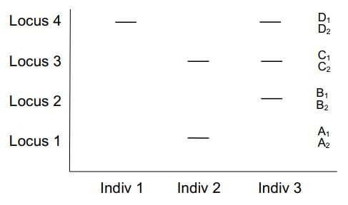

```{r setup, include=FALSE}
knitr::opts_chunk$set(
  echo = FALSE, message = FALSE, warning = FALSE, fig.align = "center",
  fig.pos = "H", out.extra = "", fig.height = 3.5, fig.width = 5
)
colores <- c("#003f5c", "#7a5195", "#ef5675", "#ffa600")
```

```{r}
library(cluster)
library(FactoMineR)
library(ggplot2)
library(ggrepel)
library(kableExtra)
library(ade4)
source(here::here("src", "utils.R"))
```

```{r}
datos_q <- read.csv2(
  here::here("data", "raw", "CUALITATIVAS.csv"), 
  row.names = 1, 
  stringsAsFactors = FALSE, 
  na.strings = "-1"
)

```
  
  
**a)** Podría en función de esta información determinar un gradiente de similaridad entre los tres individuos?

    Para poder establecer un gradiente de similaridad entre los individuos es necesario primero especificar un criterio que defina "similaridad". 
    Si consideramos la primer notacion, donde se representan los loci de cada individuos con letras, podriamos establecer que los individuos son similares si coinciden en letras y subindindices, sumando un punto por cada letra, con su respectivo subindice, coincidente. Luego, de esta manera podemos registrar el seguiente puntaje para cada uno de los pares de comparaciones. 
    
    * Individuo 1 vs Individuo 2: S~12~ = 5
    * Individuo 1 vs Individuo 3: S~13~ = 6 
    * Individuo 2 vs Individuo 3: S~23~ = 5 
    
    Por consiguiente, podriamos decir que los individuos 1 y 3 son los mas semejantes ya que registraron el mayor puntaje. 
    
Por otro lado, tambien podriamos establecer un gradiente de similaridad considerando el patron de bandas de cada individuo. Bajo esta representacion resulta util redefinir el concepto de similaridad, sumando un punto si la coincidencia en bandas es exacta y asignando medio punto si al menos coincicen una de sus bandas en cada locus. De esta forma, los puntajes que se registran son los siguientes:
    
* Individuo 1 vs Individuo 2: $S_{12}$ = 2,5
* Individuo 1 vs Individuo 3: $S_{13}$ = 3 
* Individuo 2 vs Individuo 3: $S_{23}$ = 2,5
    
Al igual que antes podemos observar que los individuos 1 y 3 son los mas semejantes.
    
Luego, si quisieramos establecer un gradiente de similaridad podriamos expresarlo de la siguiente manera: 
$S_{12}$ = $S_{23}$ < $S_{13}$

**b)** Con el fin de utilizar un coeficiente de similaridad para cuantificar la semejanza entre individuos como
codificaría el resultado obtenido del patrón de bandas ?


```{r}

ind <- c("Individuo 1", "Individuo 2", "Individuo 3")
locus <- c("A1", "A2", "B1", "B2", "C1", "C2", "D1", "D2")
ind1 <- c(0,1,0,1,0,1,1,1)
ind2 <- c(1,1,0,1,1,1,0,1)
ind3 <- c(0,1,1,1,1,1,1,1)
cod <- rbind(ind1, ind2, ind3)
colnames(cod) = locus
rownames(cod) = ind

kable(cod) %>%
      kable_styling(font_size = 8, latex_options = "HOLD_position")
    
```

    En la tabla anterior podemos observar una nueva codificacion del patron de bandas, donde se indica con ceros y unos la ausencia y presencia, respectivamente, de cada alternativa alelica.

**c)** Utilizando de los coeficientes de similaridad SM, Jaccard, Dice y Russel-Rao cuantifique las
similaridades entre los individuos 1-2 y 2-3.

```{r}
sm <- round( 1 - (dist.binary(cod, method = 2, diag = FALSE, upper = FALSE))**2, 2)
sm12 <- sm[1]
sm23 <- sm[3]
sim_sm <- cbind( sm12, sm23)

j <- round( 1 - (dist.binary(cod, method = 1, diag = FALSE, upper = FALSE))**2 ,2)
j12 <- j[1]
j23 <- j[3]
sim_j <- cbind(j12, j23)

d <- round( 1 - (dist.binary(cod, method = 5, diag = FALSE, upper = FALSE))**2, 2)
d12 <- d[1]
d23 <- d[3]
sim_d <- cbind(d12, d23)

rr <- round( 1 - (dist.binary(cod, method = 10, diag = FALSE, upper = FALSE))**2, 2)
rr12 <- rr[1]
rr23 <- rr[3]
sim_rr <- cbind(rr12, rr23)

sim <- rbind( sim_sm, sim_j, sim_d, sim_rr)
colnames(sim) = c("Individuo 1 vs Individuo 2", "Individuo 2 vs Individuo 3" )
rownames(sim) = c("SM", "Jaccard", "Dice", "Russel-Rao")

kable(sim) %>%
      kable_styling(font_size = 8, latex_options = "HOLD_position")

```


    En la tabla anterior podemos observar las similaridades obtenidas bajo los distintos coeficientes entre los individuos 1-2 y 2-3. 
    
    

**d)** Concuerda lo hallado en el inciso (c) respecto a lo esperado en (a) ? Comente al respecto.

    Cabe destacar que solamente el coeficiente Simple Matching coincide con la similaridad subjetiva establecida en el inciso anterior, donde observamos que la Similadirad entre el Individuo 1 y 2 era la misma que para los individuos 2 y 3. Esto se corresponde, principalmente, a que el coeficiente SM considera coincidencias entre "cosas" (ya sea en presencia o ausencia), tal como el criterio adoptado por nosotros en el inciso anterior para poder establecer la Similaridad subjetiva.
     
**e)** Como sería el patrón de bandas si hubiese utilizado un marcador molecular dominante ? (tomemos a la
alternativa alélica 1 como dominante sobre la 2)


```{r patron, echo=FALSE, out.width= "40%"}


```


**f)** Como codificaría esta información para poder utilizar como medida de semejanza un coeficiente de
similaridad ?

```{r}
ind <- c("Individuo 1", "Individuo 2", "Individuo 3")
locus <- c("Locus 1", "Locus 2", "Locus 3", "Locus 4")
ind1 <- c(0,0,0,1)
ind2 <- c(1,0,1,0)
ind3 <- c(0,1,1,1)
cod <- rbind(ind1, ind2, ind3)
colnames(cod) = locus
rownames(cod) = ind

kable(cod) %>%
      kable_styling(font_size = 8, latex_options = "HOLD_position")

```

**g)** Verificar resultados con R  

